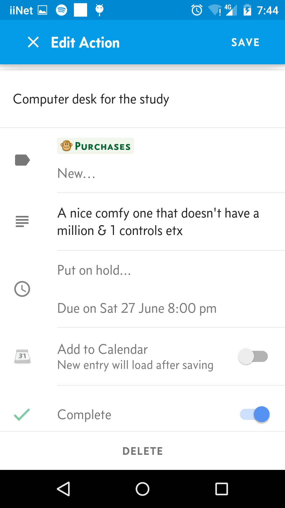

# shuffle-android Developer Setup Guide

## Introduction

The latest source code is located in the following two public Git repositories:

* https://github.com/andybryant/shuffle-android
* https://github.com/andybryant/shuffle-dto

The first is the Android application, the second the model used for backups and sync calls to Shuffle website.

The Android application now uses Gradle as its build and dependency management tool.

## Screenshots

 nbsp;&nbsp;&nbsp; 

 

## Prerequisites

	1.	Gradle 2.2+ or Android Studio 1.1+ or IntelliJ 14+
	2.	Android SDK 
	3.	Java 7.0.x

## Missing files

There are several ‘missing’ files for copyright and local customisation reasons.

## SDK Location

In the top level directory of the repository, create a file called `local.properties`. In it define a single property sdk.dir pointing at your Android SDK location.
For instance…

`sdk.dir=/Users/andy/android/android-sdk-macosx`

## Fonts

The latest version of Shuffle uses several fonts from the Concourse family. This font is not free, so cannot be included in the open source project. You can either pay for it yourself, or not include it. The application should still run (let me know if it doesn’t) but the layout may not be perfect.

To include, put files under `ShuffleAndroid/src/main/assets` and edit `FontUtils.java` if necessary.

## Website integration

Under `ShuffleAndroid/src/main/assets` web sync requires a file called integration.properties.

This file has three properties
	•	`gcm.sender.id`
	•	`sync.add` - URL of sync service. Generally `app.addr + “/device/sync”`
	•	`app.addr` - top level URL of website (http or https)

## Google Analytics

The application uses Google Analytics to gather anonymous usage information about the app. If you want this for yourself, add your own `analytics.xml` file in the `res/xml` directory. See https://developers.google.com/analytics/devguides/collection/android/v4/parameters for details.

## Android SDK files

You’ll need to download the tools and Android version that match up with the `build.gradle` file. Currently that’s SDK 21 (5.0) and Android SDK Build-tools 20.
Get everything in the SDK folder, as they’re mostly all useful. At a minimum you need SDK Platform and Google APIs.
From Extras, get most everything as well. 

## IntelliJ or Android Studio

Select Import Project and select the top level `build.gradle` file. Select ‘Use default gradle wrapper’. It will likely take a couple of minutes to import.
Add SDK > Select Android 5.0 Google APIs
Change Project Default SDK to be this SDK

