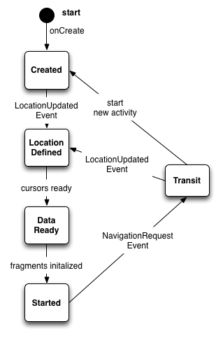

# shuffle-android Navigation

## Introduction

This document describes the different architectural options for handling navigation in Shuffle. The latest version of Shuffle supports both phones and tablets. For the later, it supports screens with both task lists and individual tasks displayed at the same time. I started off by modeling the approach around the [UnifiedMail](https://android.googlesource.com/platform/packages/apps/UnifiedEmail/) app. However instead of using the monolithic controller approach, I went with using RoboGuice events to reduce coupling between classes having separate independent classes for different functional areas such as fragment loading, menus, layout etc. UnifiedMail handles navigation within a single activity, using the FragmentManager to show and hide different components of the interface. Events in RoboGuice don't place nicely in this setup, as the binding of event handlers is tied to the lifecycle of the activity, not individual fragments. So when a fragment is removed from the display, it continues to receive events even though it is detached from the activity. This means conditions need to be added to every event handler to protect against "zombie" fragments.

## Options

### Single activity, replace fragments on navigation

What Shuffle currently does.

#### Pros 

* Potentially more efficient as don't need to destroy and recreate activity

#### Cons

* Not much reuse of fragments - manager tends to create new ones
* Roboguice event handling means all zombie fragments keep getting events
* Have to manage back nav manually
* Issues with task pager not displaying correctly after nav
* Issues with tag/project counts not working after nav

### Single activity, hide and show fragments on navigation

For both phone and tablet, have all potential fragments available in view. Can still lazily load them, but once there, leave them there.
Need to communicate to each fragment to let it know if it's activated.

#### Pros

* No more zombie fragments
* Still should be fast to load as only load fragments as needed

#### Cons

* Have to manage back nav manually

### Load new activity on navigation

#### Pros

* Get back nav cheaply (should still specify parent activity - see http://developer.android.com/training/implementing-navigation/temporal.html#SynthesizeBackStack)
* Plays nicely with RoboGuice lifecycles
* Standard Android pattern

#### Cons

* Potentially slower
* Need to create separate activities for each view, although these could be lightweight subclasses (or could just reload same activity with different intents)
* May make supporting phone and tablet more tricky

#### Implementation

1. **Created** - The activity callback into the `onCreate` method is the entry point. Here each activity loads its layout and kicks off the process of parsing the `Intent` or `Bundle` passed into the activity. Once parsed into a `Location` object it's dispatched with a `LocationUpdatedEvent`
1. **LocationDefined** - The data specific to this view is loaded from the datastore using one or more loaders. Once complete each loader dispatches a cursor update event.
1. **DataReady** - Initialize fragments with data loaded from cursors.
1. **Started** - All data has been loaded and the view has been successfully loaded. To exit this state, the user navigates to a different location. This is initiated by dispatching a `NavigationRequestEvent` contained a desired location.
1. **Transit** - The `NavigationController` determines if the new location is handled by the current activity or requires a new activity. For the former, it dispatches a `LocationUpdateEvent` shifting back into the **LocationDefined** state. For the later, it generates an `Intent` from the location using the `LocationParser` and starts a new activity for the new location.

##### Key classes

* `Location` - uniquely identifies a view in Shuffle. This takes place of old `MainView` class. Implements `Parcelable` so that it can be converted to and from a `Bundle`. Also contains `LocationActivity` indicating what activity services the given location. Possible values are: ProjectList, ContextList, TaskList (includes task view), Help, Edit Task, Edit Project, Edit Context and Preferences.
* `LocationUpdatedEvent` - Indicates a new location for the current activity has been defined.
* `NavigationRequestEvent` - single mechanism used throughout the application for navigating from one location to another. Contains many static factory methods to generate all possible locations.
* `NavigationController` - listens for `NavigationRequestEvent` events, and either loads a new activity to display the location or triggers the current activity to update itself.
* `LocationParser` - able to convert a `Location` into an `Intent` and visa versa.

